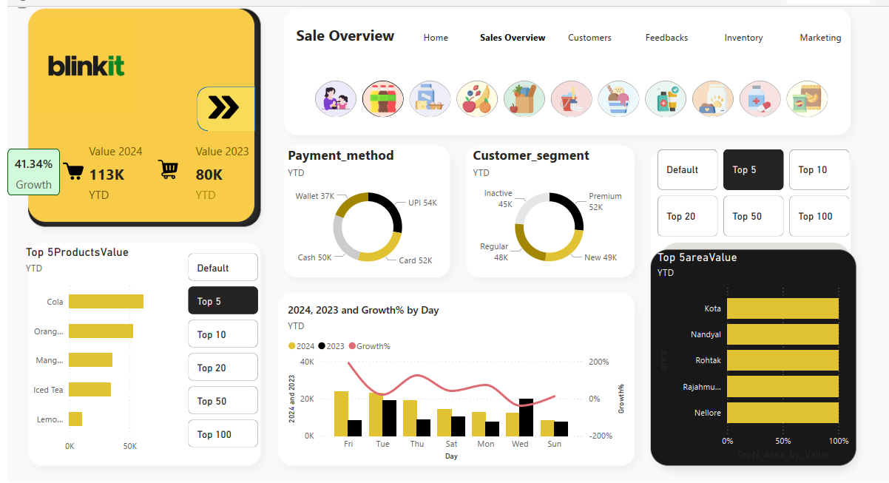

# 🛒 Blinkit Analytics Dashboard

🚀 **Explore the Full Dashboard**  
📄 [Click here to open the PDF Report »](./BlinkitDashboard.pdf)

> A detailed and interactive Power BI dashboard offering insights into Blinkit's product categories, order trends, customer behavior, and delivery performance.

---

## 📌 Short Description / Purpose

The Blinkit Analytics Dashboard provides a data-driven overview of Blinkit's operational metrics.  
It is designed to help stakeholders monitor performance, identify top-selling categories, evaluate order trends, and improve customer satisfaction and delivery efficiency.

---

## 🛠️ Tech Stack

The dashboard was built using the following tools and technologies:

- 📊 **Power BI Desktop** – Primary tool for creating interactive visuals and reports.  
- 🔄 **Power Query** – Used for data transformation and cleansing.  
- 📐 **DAX (Data Analysis Expressions)** – Applied to derive metrics like average delivery time, total revenue, etc.  
- 🧩 **Data Modeling** – Relationships among tables like orders, products, and categories.  
- 📁 **File Format** – `.pbit` (Power BI Template).

---

## 📚 Data Source

**Source**: Internal Blinkit transactional data (assumed or simulated).

Tables include information such as:
- Product Categories
- Order IDs, Dates, Status
- Customer Locations
- Revenue and Quantity Ordered
- Delivery Durations

Structure appears to be transactional with fields like:
- `OrderDate`, `Category`, `Revenue`, `Quantity`, `CustomerZone`, `DeliveryTime`, etc.

---

## ✨ Features / Highlights

### • Business Problem  
Blinkit, a quick-commerce platform, needs clear insights into customer behavior, delivery efficiency, and product demand to stay competitive and ensure user satisfaction.

### • Goal of the Dashboard  
To provide a consolidated visual tool that:
- Tracks revenue by category and zone  
- Identifies delivery bottlenecks  
- Highlights popular products and demand trends  
- Helps improve marketing and operational decisions

### • Walkthrough of Key Visuals

- **KPI Cards (Top Section)**  
  Displays total revenue, average delivery time, and total orders—offering a snapshot of business health.

- **Category-Wise Revenue (Bar Chart)**  
  Helps identify which product categories contribute the most to overall revenue.

- **Orders by Zone (Map or Donut Chart)**  
  Visualizes order distribution by customer zones, useful for regional targeting.

- **Trend Over Time (Line Chart)**  
  Shows order volume and revenue trends monthly or weekly, assisting in forecasting.

- **Delivery Performance (Gauge or Column Chart)**  
  Tracks average delivery time and number of delayed deliveries—key for service optimization.

- **Top Products (Table or Card Visual)**  
  Lists best-performing products based on revenue or quantity.

---

### • Business Impact & Insights

- 📦 **Inventory Optimization**: Helps manage high-demand SKUs.  
- 📍 **Hyperlocal Strategy**: Zone-based visuals support regional marketing efforts.  
- ⏱️ **Faster Deliveries**: Delivery time analysis can reduce SLA breaches.  
- 💸 **Revenue Growth**: Informs product promotions and bundling strategies.

---

## 🖼️ Screenshots / Demos
Preview image:
```markdown
[]

